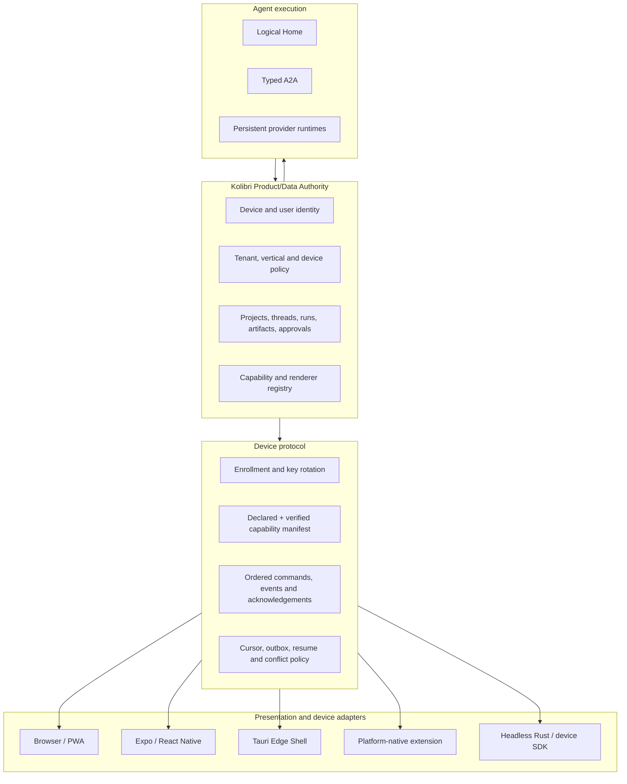

# Kolibri device and surface architecture

- Status: accepted direction; implementation is incremental
- Date: 2026-07-30
- Goal: Kolibri on digital devices with screens and without screens
- Principle: protocol-first, capability-driven, multiple shells

## 1. Product requirement

Kolibri is intended to operate across:

- desktop and laptop computers;
- phones and tablets;
- ordinary browsers and installed applications;
- kiosks and industrial terminals;
- televisions and large shared displays;
- vehicle and spatial surfaces;
- watches and other wearables;
- voice terminals;
- gateways, sensors, printers and other headless devices.

No single UI toolkit covers these surfaces well. The universal layer is
therefore device identity, contracts, capabilities, agent events, policy and
portable domain logic—not one renderer.

## 2. Architecture



Product/Data remains canonical. A device can cache, calculate provisionally,
collect input or execute an explicitly granted local capability, but it cannot
silently become a second product authority.

## 3. Three capability layers

### 3.1. Physical capability

What the device can physically do:

- display geometry and safe areas;
- touch, pointer, keyboard or remote-control input;
- microphone, camera, barcode, NFC and biometrics;
- audio, haptics, notification, printing, LED or actuator output;
- connectivity and offline behavior;
- secure storage and hardware-backed keys;
- local compute and storage limits.

### 3.2. Verified platform capability

What Kolibri has verified through the runtime, permissions, attestation or a
trusted adapter. A client declaration is never sufficient on its own.

### 3.3. Authorized product capability

What the tenant, user, vertical pack and current session are allowed to use.
For example, a kiosk may physically have a camera but not be authorized to
attach images; a phone may render an estimate but not approve it.

The effective capability is the intersection:

```text
physical ∩ verified ∩ tenant policy ∩ user role ∩ vertical entitlement
```

## 4. Shell portfolio

| Shell | Primary targets | Strength | Limitation |
|---|---|---|---|
| Responsive web/PWA | Safari, Chrome, desktop browser, many TVs and kiosks | Zero-install reach and one production URL | Browser permissions, background work and hardware access vary |
| Expo/React Native | iOS and Android consumer/professional apps | Native interaction, keyboard, accessibility and mature mobile libraries | Separate renderers from the web |
| Tauri Edge Shell | Windows, macOS, Linux, managed kiosks and evaluated iOS/Android surfaces | Small system-WebView package, Rust process, native Swift/Kotlin plugins | Requires a supported OS/WebView and does not cover every embedded or wearable device |
| Platform-native extension | Watch, widget, share target, Car/TV/spatial integration where required | Correct platform lifecycle and UX | Narrow, platform-specific code |
| Headless Rust/device SDK | gateways, voice boxes, sensors, printers and controllers | No display dependency; efficient portable logic | Needs a purpose-built I/O adapter and strict command policy |

The portfolio is intentional. “Write once” applies to contracts, capabilities,
domain rules and test journeys—not every pixel or device lifecycle.

## 5. Tauri's role

Tauri 2 is a strong candidate for `Kolibri Edge Shell` because it provides:

- Windows, macOS, Linux, iOS and Android targets;
- a system WebView rather than a bundled browser engine;
- a Rust host and typed command bridge;
- Swift and Kotlin mobile plugins;
- scoped permissions/capabilities;
- access to device plugins and locally embedded resources.

It is evaluated for three concrete uses:

1. signed desktop application with files, notifications, deep links and
   optional offline work;
2. managed kiosk/terminal distribution;
3. mobile shell where it can meet the same keyboard, gesture, accessibility,
   camera, audio, background and performance bar as the native baseline.

Tauri is not required for:

- ordinary Safari/Chrome access;
- a device without a supported WebView;
- headless execution;
- the Rust calculation engine;
- internal agent transport.

Official technical basis:

- [Tauri overview](https://v2.tauri.app/start/)
- [Tauri mobile plugin development](https://v2.tauri.app/develop/plugins/develop-mobile/)
- [Tauri features and plugin support](https://v2.tauri.app/plugin/)

## 6. Rust workspace strategy

Reusable Rust belongs in framework-independent crates:

```text
packages/
  estimate-kernel-rs/       # construction vertical arithmetic
  device-protocol-rs/       # future manifest/event types and validation
  sync-core-rs/             # future durable cursor/outbox logic
  policy-core-rs/           # future local capability checks

apps/
  kolibri-edge-tauri/       # shell adapter, not the owner of domain rules
  kolibri-device-daemon/    # future headless adapter
```

Only a proven need justifies each crate. The week-one release adds the estimate
kernel and device contract, not an untested universal local runtime.

Crates must not directly own:

- tenant database records;
- canonical thread or estimate history;
- provider credentials;
- vertical activation;
- final approval;
- remote command authorization.

## 7. Device enrollment and trust

Target enrollment:

1. create a short-lived enrollment challenge;
2. generate or load a device-bound key;
3. authenticate the user or administrator;
4. submit the declared capability manifest;
5. verify runtime/platform evidence where available;
6. issue a scoped device session;
7. return the server-authoritative capability snapshot;
8. rotate and revoke device credentials independently from the user account.

The backend already uses opaque mobile access/refresh tokens with server-side
hashing and rotation. Device keys and attestation can be layered without
placing long-lived provider credentials in a client.

## 8. Event and command model

User-facing agent progress continues through ordered, durable AG-UI events.
A2A remains an internal agent-to-agent boundary.

Device-specific operations use a separate typed boundary:

```text
kolibri.device.capability-manifest/1.0
kolibri.device.command/1.0
kolibri.device.event/1.0
kolibri.device.ack/1.0
```

A device command contains at minimum:

- tenant, device and capability binding;
- command ID and idempotency key;
- issued/expiry time;
- policy version;
- bounded typed payload;
- acknowledgement requirement.

There is no generic “execute shell text” command. Hardware actions are
allowlisted semantic capabilities such as `document.print`, `photo.capture` or
`status.light.set`, each with its own contract and policy.

## 9. Offline and synchronization

Offline support is per capability, not a global promise.

- Read caches carry tenant, object version and expiry.
- Local mutations enter an encrypted outbox with idempotency keys.
- Reconnect resumes from a durable server cursor.
- Conflicts use domain policy; estimate approval never uses last-write-wins.
- Provisional local Rust calculation is recomputed by the server.
- Revocation prevents new privileged work even if cached content remains.
- Data retention and wipe policy are device- and vertical-specific.

## 10. Screen composition

The server returns semantic capabilities and data, not arbitrary downloaded UI
code. Each release contains allowlisted renderers for its shell.

Examples:

- phone: chat-first navigation, bottom composer, native keyboard/safe area;
- desktop: dense project and editor workspace;
- TV: remote-focusable review/progress surface;
- watch: approval summary or notification, not the full estimate editor;
- kiosk: fixed task flow and administrator exit;
- headless: no renderer, only typed input/output capabilities.

The same artifact may therefore have several projections without duplicating
its canonical data.

## 11. Tauri versus Expo evaluation gate

Do not choose by ideology or by a hello-world bundle. Run the same real Kolibri
journey on physical iPhone and Android devices.

Required evidence:

- launch and first-interaction latency;
- chat scroll and streaming frame stability;
- keyboard, selection and multiline composer behavior;
- safe area, rotation and large text;
- VoiceOver/TalkBack;
- drawer gestures, long press and haptics;
- attachment picker, camera and microphone permission flows;
- suspend/resume and reconnect;
- encrypted token storage;
- push/deep-link behavior;
- crash rate, memory and package size;
- implementation and maintenance cost.

Expo/React Native is the reference implementation for native mobile quality.
Tauri may replace or complement it only if this matrix passes without
device-specific UX regressions.

## 12. Delivery sequence

### Week-one production

- responsive browser product;
- exact mobile Safari behavior;
- device-aware but browser-safe capability checks;
- Expo truth spike;
- device manifest contract;
- no Tauri dependency in the critical release path.

### Next 30 days

- Tauri desktop/edge spike using the same web build and API contracts;
- physical Windows/macOS test;
- one managed kiosk scenario;
- mobile comparison on one iPhone and one Android device;
- server device registry and revoke flow;
- decide shell portfolio from the evaluation matrix.

### 31–90 days

- signed desktop candidate if the spike passes;
- offline read/outbox slice;
- notifications, deep links and local files;
- headless Rust SDK proof with one real device class;
- device telemetry and fleet administration.

### Later

- TV/watch/spatial adapters only for a validated customer workflow;
- local model or agent execution only with resource, privacy and policy gates;
- third-party hardware SDK after first-party device contracts stabilize.

## 13. Non-negotiable tests

- tenant isolation across every device cache and event;
- device revocation and refresh-token replay rejection;
- capability downgrade after policy change;
- expired/replayed command rejection;
- offline idempotency and reconnect;
- exact runtime/bootcamp binding for agent work;
- server recomputation of consequential local results;
- accessible primary journey on every claimed screen class;
- no advertised control without a working capability.

The architectural choice is therefore not “Tauri or React Native.” It is:

> Kolibri protocol and Rust domain core everywhere; the best verified shell
> for each device class.

