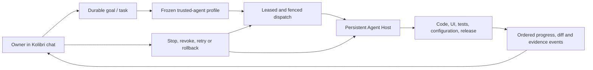

# Owner trusted-agent runtime

Kolibri V3 is an agentic development and operations environment inside the
product. The platform owner assigns a goal in Product Chat; trusted agents may
edit code and UI, run tests, configure execution nodes and perform an
observable, policy-bound deploy/rollback workflow without stopping for
per-command approval. Progress, tool activity, diffs, evidence and the terminal
result remain visible in the application.

`executionMode: "developer"` is only a browser request hint. The backend
independently requires the singleton server-derived platform owner,
`chat.developer.request`, active platform policy, an exact runtime/model and a
server-owned execution route. A tenant role named `owner` does not grant this
authority.

## Execution profiles

`full + danger-full-access + never` is a supported autonomous trusted-agent
profile. `never` means that an agent does not stop for approval before every
tool call inside its already delegated scope. It does not mean that a browser
may invent authority.

A durable owner-configured profile binds:

- platform authority ID and epoch;
- agent/card identity and version;
- runtime profile and model selection;
- an opaque, server-owned mutable workspace binding and revision;
- environment, tool and network scope;
- access, sandbox and approval policy;
- concurrency, budget, lifecycle and kill switch.

New developer runs freeze the selected profile/workspace IDs and epochs.
Changing or revoking the profile/authority blocks Product-side dispatch and
result commit. The next transport revision must also derive a short-lived,
fenced Agent Host lease from this tuple. Ordinary runs do not require repeated
interactive approval.

## Owner control loop

Product Chat is the task submission and supervision surface. It does not expose
an unrestricted shell to the browser. A submitted goal becomes a durable task,
the selected trusted service identity receives a leased assignment, and its
events are projected back into the same conversation.

The owner can observe live status, tool summaries, diffs, tests, artifacts and
notifications; cancel a task; revoke the delegated profile; or initiate a
durable rollback. These controls are interventions over autonomous execution,
not approval prompts inserted before every tool call. Optional review gates may
be attached only to explicitly configured classes of irreversible effect.

Target end-to-end control loop:



The browser, native client and future device shells all present this as one
Kolibri workflow. Agent Host, worker and A2A are implementation boundaries,
not separate operator products that the owner must leave Kolibri to use.

## Local development

The embedded adapter is deliberately limited to non-production development:

```dotenv
KOLIBRI_V3_ENV=development
KOLIBRI_V3_DIRECT_MODEL_RUNTIME=true
KOLIBRI_V3_DEVELOPER_AGENT_ENABLED=true
KOLIBRI_V3_DEVELOPER_WORKSPACE_ROOT=/absolute/path/to/mutable-workspace
KOLIBRI_V3_DEVELOPER_AGENT_TIMEOUT_SECONDS=1800
```

The backend host must already have an authenticated supported agent runtime.
No provider API key is stored in Product Chat. The configured workspace must
be an explicitly designated writable source workspace; it may be the project
repository itself. It must not be an active immutable release directory or its
`current` activation link.

## Production

The public API process never launches a privileged local shell. Standard chat
may still use a direct model runtime, while production developer work is
server-routed through the internal Home/Provider Agent Host plane. This remains
one Kolibri experience and one provider-neutral chat adapter; the physical
worker is separated so it can be supervised, fenced, cancelled and recovered
independently of the web process.

Today the Product worker revalidates the frozen owner/profile/workspace tuple
before Home delivery and before accepting a result. A2A v1.3 must additionally
carry that tuple, a task lease, deadline and idempotency binding so Agent Host
can validate it independently. Agent Host runs under a dedicated OS/container
identity without Product database credentials. Until v1.3 lands, Product-side
revalidation is real, but external independent enforcement and preemptive
cancellation are not yet complete.

## Verification

```bash
cd kolibri-v3
npm run typecheck
npm test
PYTHONPATH=backend backend/venv/bin/python -m pytest -q backend/tests
```
