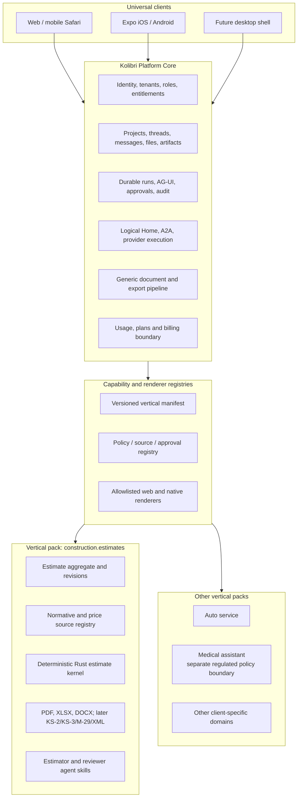

# Kolibri: universal agent platform and vertical packs

- Status: accepted architecture baseline
- Date: 2026-07-30
- First commercial vertical: `construction.estimates`
- Product identity: universal agentic workspace, not a single-purpose estimate app

## 1. Strategic definition

Kolibri has two different product layers:

1. **Kolibri Platform** — a universal multi-tenant agentic workspace.
2. **Vertical Pack** — an installable, entitled and versioned domain product
   that supplies specialist contracts, tools, sources, policies, documents,
   calculations and UI projections.

Construction estimates are the first commercial vertical because the user pain
is concrete, recurring and measurable. They validate the platform under a hard
domain: deterministic arithmetic, source provenance, regulatory change,
versioned documents, professional review and financial consequences.

The platform must later support an auto-service, legal workflow, manufacturing
or a medical assistant without forking identity, chat history, agent transport,
projects, files, mobile clients, billing or operations.

## 2. Layered architecture



The registry activates trusted first-party capabilities. It does not download
and execute arbitrary UI or server code from a manifest.

## 3. Platform Core responsibilities

The Core owns only reusable product concepts:

| Core concept | Responsibility |
|---|---|
| Tenant / organization | isolation, plan, region, policy set |
| User / device session | identity, roles, secure browser/native auth |
| Project | universal work container |
| Thread / message | durable conversational history |
| Run / task | durable execution, progress, retry, cancel |
| Agent assignment | typed A2A boundary and authority |
| File / artifact | versioned binary or structured result |
| Approval | human decision and audit record |
| Document | generic snapshot, render job and immutable export |
| Capability | server-authoritative availability and entitlement |
| Usage event | metering without vertical-specific pricing logic |

Core does not contain `estimate row`, `diagnosis`, `vehicle repair operation`,
`ФСНБ`, `КС-2`, medical code or another domain-specific entity.

## 4. Vertical Pack responsibilities

Each vertical owns:

- versioned domain schemas and migrations;
- domain aggregate and state transitions;
- deterministic validators and calculators;
- source adapters and provenance policy;
- agent capability inputs/outputs and evaluation corpus;
- domain artifacts, editors and read-only renderers;
- document templates and export adapters;
- review and human-approval requirements;
- domain permissions and entitlements;
- domain telemetry and quality metrics.

Domain data links to Core by opaque IDs:

```text
tenant_id + project_id + artifact_id
  → namespaced vertical aggregate
  → immutable vertical revision
  → generic artifact/document reference
```

Typed vertical tables or stores are preferred over one universal EAV/blob
database. Generic JSON is acceptable only at a versioned contract boundary,
not as an unvalidated substitute for a domain model.

## 5. Vertical manifest contract

The manifest schema is
`contracts/v1/verticals/vertical-pack-manifest.schema.json`.

It declares:

- stable vertical ID and package version;
- capabilities and their input/output contracts;
- supported client surfaces;
- required entitlements;
- artifact kinds and allowlisted renderer/editor keys;
- agent capabilities;
- data classification, source policy and approval policy.

It never contains:

- executable JavaScript, Python or Rust;
- credentials;
- arbitrary import paths;
- provider API keys;
- direct database access;
- uncontrolled external URLs;
- permission to bypass tenant, source or approval policy.

The release compiles trusted adapters and registries. At runtime the server
returns only the tenant-authorized capability snapshot.

## 6. Client composition

### Universal shell

Web and native clients always provide:

- authentication and account settings;
- project/thread navigation;
- chat and composer;
- attachments;
- run progress, cancel and retry;
- generic artifact library;
- approvals and notifications;
- theme, accessibility and platform behavior.

### Vertical surfaces

Vertical navigation and actions appear only when both are true:

1. the release contains an allowlisted renderer/editor for the capability;
2. the authenticated tenant capability snapshot enables it.

For `construction.estimates`, the registered surfaces include estimate editor,
price/source evidence, revisions and exports. For an auto-service tenant they
may instead include a vehicle work order and parts catalog. The hamburger,
settings, chat and project shell do not fork.

Web and React Native share contracts, state machines and semantic action IDs,
not renderers. DOM components are not embedded in the native client.

## 7. Backend composition

Target module layout:

```text
kolibri-v3/backend/app/
  core/
    identity/
    projects/
    chat/
    runs/
    artifacts/
    documents/
    capabilities/
  verticals/
    construction_estimates/
      api/
      domain/
      sources/
      policies/
      adapters/

kolibri-v3/components/
  core/
  verticals/
    construction-estimates/

apps/kolibri-mobile/
  core/
  verticals/
    construction-estimates/

packages/
  estimate-kernel-rs/

contracts/v1/
  verticals/
  estimates/
```

R1 does not require a big-bang file move. It requires the capability boundary
and prohibits new construction imports into Core. Existing coupling is reduced
incrementally behind adapters and contract tests.

## 8. Agent composition

Core agents expose generic capabilities such as:

- project intake;
- document reading;
- planning;
- search/retrieval;
- artifact review;
- user clarification.

A vertical adds specialist Agent Cards/skills:

- `construction.estimate.intake`;
- `construction.estimate.calculate`;
- `construction.price.source`;
- `construction.normative.review`;
- `construction.document.verify`.

Product/Data creates the durable run. Logical Home assigns the capability.
A2A transports typed assignments and evidence. A vertical agent cannot write
canonical Core or domain history directly; it returns a candidate that the
owning Product/Data service validates and commits.

The same mechanism can later register `auto_service.work_order.plan` or a
regulated medical capability. A medical vertical must have a separate data
classification, consent, retention, audit and human-safety policy. Enabling a
new label or prompt is not sufficient to claim medical readiness.

## 9. Rust calculation boundary

`packages/estimate-kernel-rs` belongs to the construction estimate pack, not
to Platform Core. Its contract is generic within the estimate domain:
normalized rows, cost categories, commercial terms, price evidence status and
deterministic totals.

The kernel:

- has no tenant database, network, LLM, UI or document renderer;
- accepts only versioned normalized input;
- uses fixed-precision decimal arithmetic;
- emits a versioned deterministic result;
- cannot mark an estimate approved or verified;
- runs in shadow mode until parity is demonstrated.

This keeps Rust reusable from Python, a future internal service, WASM preview
or native preview without tying the universal platform to Tauri.

## 10. Data and regulatory isolation

- Every Core and vertical record is tenant-scoped.
- A tenant has an explicit list of enabled verticals and versions.
- Cross-vertical data use requires an explicit typed adapter and policy.
- Vertical-specific retention never silently inherits a weaker Core default.
- Search indexes and model context preserve tenant and vertical boundaries.
- Export manifests record vertical ID, contract version, engine version,
  source policy and approval decision.
- Regulated verticals can require separate storage, encryption keys,
  deployment region and provider allowlist.

## 11. Commercial model

The architecture supports:

```text
Platform plan
  + one or more vertical packs
  + usage (models, storage, documents, integrations)
  + optional professional review / implementation
```

The first offer is construction-focused because a universal product without a
sharp initial problem is difficult to sell. The public promise should be
specific — faster, evidence-backed construction estimates and documents —
while the underlying architecture remains reusable.

The first vertical provides the learning loop for:

- activation and time to first useful artifact;
- agent completion and correction rates;
- document acceptance;
- willingness to pay;
- source quality and liability;
- team collaboration and retention.

## 12. R1 architecture gate

Before production:

- `construction.estimates` has a valid manifest;
- the server capability snapshot is authoritative;
- estimate navigation/actions are capability-gated;
- hidden/disabled behavior is deterministic when the pack is unavailable;
- Core contracts do not import estimate schemas;
- the Rust estimate kernel passes its independent golden tests;
- desktop and mobile clients consume the same capability meaning;
- no runtime-downloaded plugin code exists.

This gate lays the universal architecture now while keeping the seven-day
release focused on one commercial vertical.

